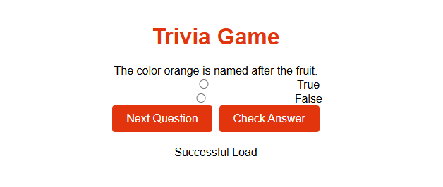
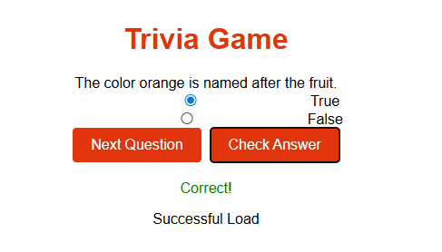
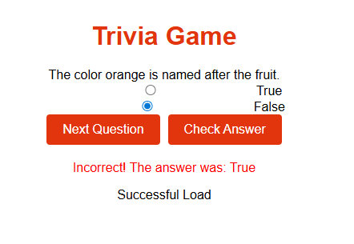
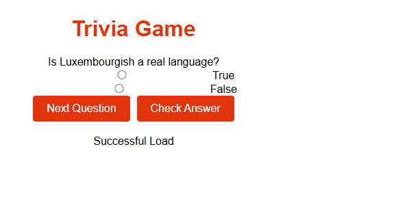

# Trivia Game

<b> Table of Contents</b>

- [Summary](#summary)
- [New Concepts](#new-concepts)
- [ScreenShots](#screenshots)
  - [Main Page](#main-page)
  - [Validation](#validation)
  - [Cleared](#cleared)
- [Maintainers](#maintainers)
-----------

### Summary

In this program, it will act as a trivia game, 
where true or false questions will be presented to
you that you must answer.  
---------

## New Concepts

- <b>CH 14</b>: Fetch, Get,Post, Asynchronous Funtions
- <b>CH 15</b>: Node.js
- API Functions
----------

## ScreenShots

## Main Page

-----------
## Validation

------------
## Cleared

---------
### Maintainers
[@tarath01](https://github.com/tarath01) Taylor Rath

[Back to the Top](#trivia-game)
